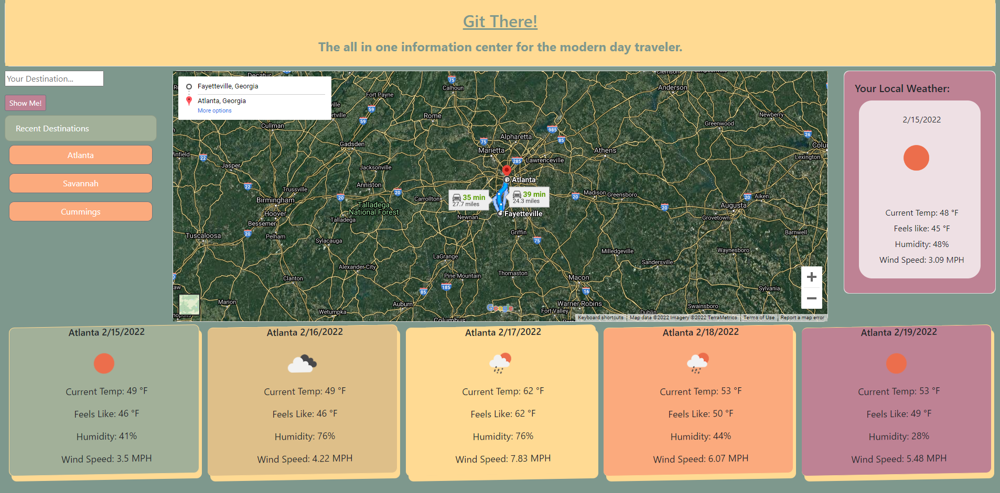

# Git There
Using the Google maps API and the Open Weather Map API, the traveler will be able to search to receive directions to the desired destination from their current location. The search will also return the current weather and forecast for the destination.  

## Live Links
* Published: https://freemanmitch13.github.io/git-there/ 
* Repository: https://github.com/FreemanMitch13/git-there

## Description
As a traveler, I want to be able to search for directions to a destination and also recevive weather conditions so that I can plan accordingly. 

## Criteria
GIVEN I am using the app to search the weather and directions
* When I enter the app
    * THEN the current local weather is displayed
    * THEN an interactive map is displayed
* WHEN I enter a city into the search
    * THEN the city weather is displayed
* WHEN I enter a city into the search
    * THEN city weather is displayed for the next 5-days
* WHEN I enter a city into the search
    * THEN the driving directions from the current location to the destination is displayed on the map
* WHEN I select "more options" from the map
    * THEN I am taken to a new tab with the current search results and the full Google Maps functionality
* WHEN I enter a city into the search
    * THEN recent searches are saved
* WHEN I refresh the page
    * THEN the saved events persist
* WHEN I select a previous destination
    * THEN the search is repeated with up-to-date results

## Usage
The following animation demonstrates the application functionality:

The following image demonstrates map view choices

## Technologies Used:
* Bootstrap 4
* jQuery
* Google Maps API
* Open Weather API

## Credits:
* Sandra Smith GA Tech
* Christopher Ponzio https://github.com/ChristopherPonzio
* Mitchell Freeman https://github.com/FreemanMitch13
* Harrison Kane https://github.com/FNH57
* Michelle Blackwell https://github.com/mblackwellgca

## License
MIT License
---